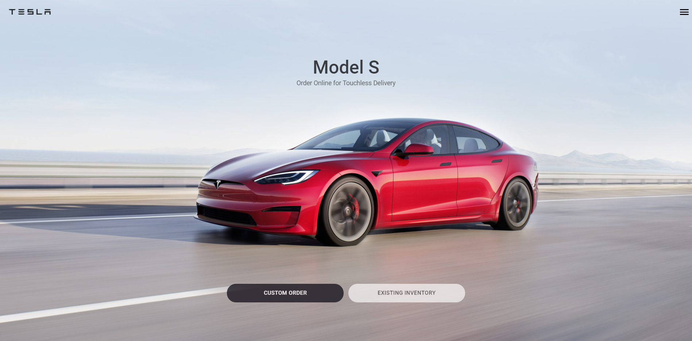
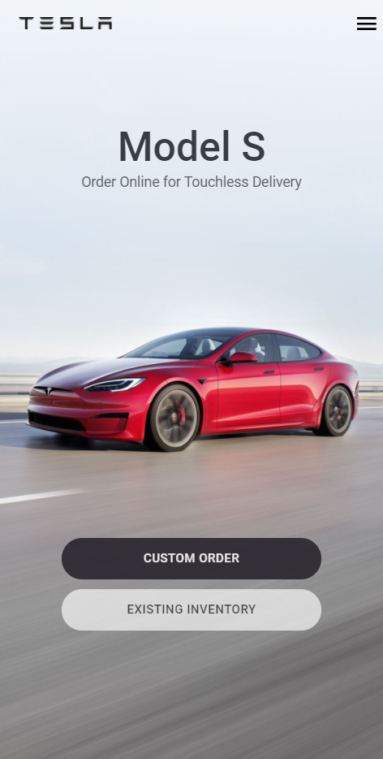

# Tesla homepage clone

This is a Ui clone of the homepage of tesla using react.

## Table of contents

- [Overview](#overview)
  - [Preview](#Preview)
  - [Links](#links)
- [My process](#my-process)
  - [Built with](#built-with)
- [Social medias](#Social-Medias)

## Overview

### Preview

### Links

- Live Site URL: [Tesla clone](https://ui-clone-t.netlify.app/)

## My process

### Built with

- [Typescript](https://www.typescriptlang.org/) 
- [React](https://reactjs.org/)
- [Styled Components](https://styled-components.com/) 
- [Framer Motion](https://www.framer.com/motion/) 

## My Social medias

- Linkedin - [Vitor Silva](https://www.linkedin.com/in/vitor-silva-dev/)
- Instagram - [@joao_vitor.p.s](https://www.instagram.com/joao_vitor.p.s/)

